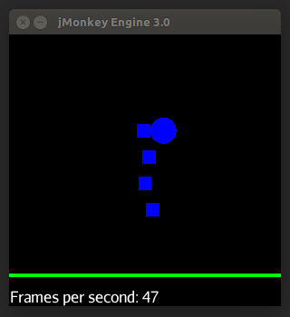

#jMonkeyEngine 2D using Dyn4J.

##Rationale.
jMonkeyengine has an excellent 3D physics engine bundled - Bullet. I've recently been trying to make a 2D game with physics using all the standard stuff in jME, with mixed luck. I came really close by forcing Z=0f using physics tick listeners. But when stuff moved really fast (projectiles or really hard collisions) stuff started flying behind each other and I figured switching to a native 2D physics engine was the right way to go.

##Solution.
Attempt to mimic the familiar API you use when using standard bullet.

Has a AppState - Dyn4JAppState, trying to be like BullettAppState

```groovy
		dyn4JAppState = new Dyn4JAppState()
		stateManager.attach(dyn4JAppState)
```

Has a Control - Dyn4JShapeControl, tries to be like the bullett controls (RigidBody etc)
```groovy
		Box b = new Box(new Float(width), new Float(thickness), 0.1f)
		Geometry floorGeom = new Geometry("Box", b)
		Material mat = new Material(assetManager, "Common/MatDefs/Misc/Unshaded.j3md")
		mat.setColor("Color", ColorRGBA.Green)
		floorGeom.setMaterial(mat)
		floorGeom.setLocalTranslation(0f, -8f, 0f)
		rootNode.attachChild(floorGeom)
		floorGeom.addControl(new Dyn4JShapeControl(new Rectangle(width*2, thickness*2), MassType.INFINITE))
		dyn4JAppState.add(floorGeom)
```

##Current state.
Got solid item working (floor) and a couple of squares and circles bouncing on it. The controller is leaky and forcing you to use dyn4j classes. Needs to test on complex collision boxes. Needs a character control, not sure if that exists.

Check BasicTest.groovy in src/test/groovy :



