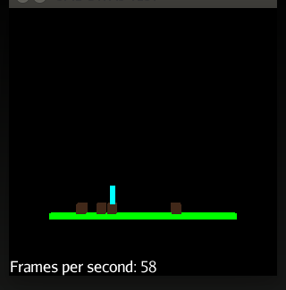

#jMonkeyEngine 2D using Dyn4J.

###Basic Shapes


### Player control


##Rationale.
jMonkeyengine has an excellent 3D physics engine bundled - Bullet. I've recently been trying to make a 2D game with physics using all the standard stuff in jME, with mixed luck. I came close by forcing Z=0f using physics tick listeners. But when stuff moved fast (projectiles or really hard/fast collisions) stuff started moving behind each other (Z axis) and I figured trying to switch to a pure 2D physics engine was the right way to go.

##Solution.
Attempt to mimic the familiar API you use when using standard bullet.

Dyn4JAppState, trying to be like BullettAppState

```groovy
		dyn4JAppState = new Dyn4JAppState()
		stateManager.attach(dyn4JAppState)
```

Dyn4JShapeControl - Tries to behave like RigidBodyControl
```groovy
	private createBox(Vector2f location, Dyn4JAppState dyn4JAppState) {
		Double boxSize = 0.5f;
		
		// jME Geometry:
		Geometry boxGeom = new Geometry("Box", new Box(new Float(boxSize), new Float(boxSize), 0.1f))
		Material mat = new Material(assetManager, "Common/MatDefs/Misc/Unshaded.j3md")
		mat.getAdditionalRenderState().setWireframe(true);
		mat.setColor("Color", new ColorRGBA(new Float(255/255f),new Float(228/255f),new Float(225/255f), 1f))
		boxGeom.setLocalTranslation(location.x, location.y, 0f)
		boxGeom.setMaterial(mat)
		rootNode.attachChild(boxGeom)
		
		// The Control:
		Dyn4JShapeControl physics = new Dyn4JShapeControl(
			new Rectangle(new Float(boxSize*2), new Float(boxSize*2)), MassType.NORMAL,
			100, //100 kg
			0.8, // quite high friction
			0)   // not slippery
			
		// Glue jME with Dyn4J:
		boxGeom.addControl(physics) // <-- Let Dyn4JShapeControl handle the jme Geometry from now on.
		dyn4JAppState.add(boxGeom)
	}
```

##Current state.
Got solid item working (floor) and a couple of squares and circles bouncing on it. The controller is leaky, forcing you to use dyn4j internal classes. Player control seems working but primitive.

Run the tests in src/test/groovy to see what's up.

##Get it
Check out the code and run the tests.

or add it to your project. The packaging may be bad, so feedback is apprichiated.
```gradle
  repositories {
    maven {
      url 'http://dl.bintray.com/johnsen/maven'
    }
  }
  /*
  ...
  */
  dependencies {
    compile 'jme-dyn4j:jme-dyn4j:0.1'
  }
```


